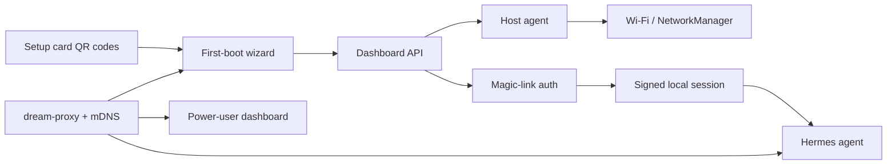

# Dream Server H2 on AMD Strix Halo

Gamma.ai source outline for an AMD-facing partnership deck.

This brief keeps the public product story hardware-neutral while using AMD
Strix Halo as the concrete example platform. The feature is deployed in the
Dream Server codebase and tested in pieces, but it still needs complete
end-to-end validation on packaged target hardware before it should be described
as production-ready appliance onboarding.

## Slide 1: Dream Server H2

**Headless Helper for local AI hardware**

Dream Server H2 turns a local AI machine into an approachable appliance: power
it on, scan a QR code, finish setup from a phone or laptop, and start using a
local agent without needing a monitor.

## Slide 2: The Problem

Local AI hardware is powerful, but setup still feels like a developer workflow.

- Many small AI appliances ship without a permanent monitor or keyboard.
- Users may not know the device IP address, host name, or service ports.
- Wi-Fi setup, local discovery, authentication, and chat access are usually
  separate chores.
- The strongest hardware story can be weakened if the first-run experience
  starts with SSH, logs, and network debugging.

## Slide 3: The Opportunity

Make local AI hardware feel more like opening a useful device than configuring a
server.

- A vendor, reseller, lab, or friend can preinstall Dream Server.
- The recipient can set up the device from a phone, laptop, tablet, or TV.
- Power users still get the full dashboard, diagnostics, model controls, and
  service visibility.
- Everyday users can land directly in a local chat and voice-capable agent
  surface.

## Slide 4: Why Strix Halo Is A Strong Example

Strix Halo is an ideal demo platform for this workflow because it combines
local-AI-class memory bandwidth, APU simplicity, and living-room-friendly form
factors.

- One compact machine can run useful local models.
- Unified memory helps make larger local models more approachable.
- The same setup flow also applies to other capable hardware.
- AMD can show a complete user journey, not only benchmark numbers.

## Slide 5: The Solution

Dream Server H2 connects the first-run pieces into one appliance flow.

- Printed setup card with Wi-Fi and setup URL QR codes.
- Optional first-boot access point for machines not already on a network.
- Mobile-friendly setup wizard.
- Host-side Wi-Fi scan and connect actions.
- Local mDNS names such as `dashboard.dream.local` and `chat.dream.local`.
- Magic-link invite QR that gives the first user an authenticated session.
- Hermes agent surface behind Dream Server session auth.

## Slide 6: User Journey

1. Power on the preinstalled device.
2. Scan the setup card QR code.
3. Join the setup AP or open the local setup URL.
4. Pick a Wi-Fi network from the first-boot wizard.
5. Scan the invite QR.
6. Land in a local agent chat experience.
7. Open the dashboard later for models, services, telemetry, and diagnostics.

## Slide 7: Architecture

## Slide 8: Code Proof Points

- Setup card QR generation:
  [generate-setup-card.py](https://github.com/Light-Heart-Labs/DreamServer/blob/62a7391d0b9d8c69ff0a48824d727950916e1f2a/dream-server/scripts/generate-setup-card.py#L51)
- First-boot wizard:
  [FirstBoot.jsx](https://github.com/Light-Heart-Labs/DreamServer/blob/62a7391d0b9d8c69ff0a48824d727950916e1f2a/dream-server/extensions/services/dashboard/src/pages/FirstBoot.jsx#L80)
- Setup and Wi-Fi API:
  [setup.py](https://github.com/Light-Heart-Labs/DreamServer/blob/62a7391d0b9d8c69ff0a48824d727950916e1f2a/dream-server/extensions/services/dashboard-api/routers/setup.py#L315)
- Host-side Wi-Fi control:
  [dream-host-agent.py](https://github.com/Light-Heart-Labs/DreamServer/blob/62a7391d0b9d8c69ff0a48824d727950916e1f2a/dream-server/bin/dream-host-agent.py#L1216)
- Magic-link QR and redemption:
  [magic_link.py](https://github.com/Light-Heart-Labs/DreamServer/blob/62a7391d0b9d8c69ff0a48824d727950916e1f2a/dream-server/extensions/services/dashboard-api/routers/magic_link.py#L382)
- First-boot AP mode:
  [ap-mode.sh](https://github.com/Light-Heart-Labs/DreamServer/blob/62a7391d0b9d8c69ff0a48824d727950916e1f2a/dream-server/scripts/ap-mode.sh#L2)
- LAN discovery:
  [dream-mdns.py](https://github.com/Light-Heart-Labs/DreamServer/blob/62a7391d0b9d8c69ff0a48824d727950916e1f2a/dream-server/bin/dream-mdns.py#L4)
- Local reverse proxy:
  [dream-proxy Caddyfile](https://github.com/Light-Heart-Labs/DreamServer/blob/62a7391d0b9d8c69ff0a48824d727950916e1f2a/dream-server/extensions/services/dream-proxy/Caddyfile#L65)
- Hermes authenticated entry path:
  [hermes-proxy Caddyfile](https://github.com/Light-Heart-Labs/DreamServer/blob/62a7391d0b9d8c69ff0a48824d727950916e1f2a/dream-server/extensions/services/hermes-proxy/Caddyfile#L1)

## Slide 9: Demo Plan

Show the complete flow on a Strix Halo device while describing it as a
hardware-neutral Dream Server capability.

- Start with the device powered on and no monitor attached.
- Scan the setup card from a phone.
- Open the first-boot wizard.
- Join Wi-Fi or confirm existing LAN connectivity.
- Scan the magic-link invite QR.
- Chat with Hermes from the phone or laptop.
- Open the dashboard to show local services, model status, and controls.

## Slide 10: What Still Needs Validation

The code is present, but the appliance story needs hardware image validation.

- End-to-end setup on the exact Strix Halo image.
- Wi-Fi adapter AP-mode compatibility.
- NetworkManager behavior across target Linux distributions.
- mDNS behavior across common phone, laptop, router, and VPN environments.
- Hermes auth handoff through the proxy on the packaged image.
- Recovery path when the user changes networks or loses the setup card.

## Slide 11: Partnership Ask

Work together to turn the implemented feature into a polished hardware demo and
marketplace-ready user journey.

- Access to representative Strix Halo hardware and target OS images.
- AMD guidance on Lemonade, ROCm, Vulkan, and model packaging best practices.
- Co-validation of the headless first-run flow.
- A Dream Server listing in the Lemonade Marketplace once the user journey is
  validated.
- Optional co-marketing around local AI appliance experiences on Strix Halo.

## Appendix: Repo Reference

- Hardware-neutral repo doc:
  [HEADLESS-SETUP.md](HEADLESS-SETUP.md)
- Setup card operator doc:
  [SETUP-CARD.md](SETUP-CARD.md)
- Hermes integration:
  [HERMES.md](HERMES.md)
- Hermes SSO:
  [HERMES-SSO.md](HERMES-SSO.md)
- AP mode:
  [AP-MODE.md](AP-MODE.md)
- Local proxy:
  [DREAM-PROXY.md](DREAM-PROXY.md)
- mDNS:
  [MDNS.md](MDNS.md)
